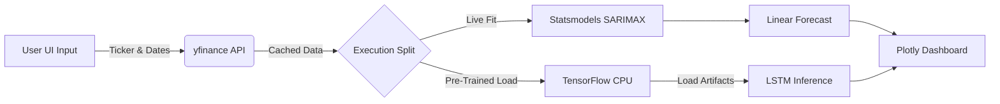

# 📈 Stock Market Price Prediction System
*An End-to-End Hybrid Forecasting Application (SARIMAX + LSTM)*


Welcome to the **Stock Market Price Prediction System**, a production-grade, highly interactive web application designed to forecast financial time-series data. 

Rather than relying on a single mathematical approach, this project implements a **Dual-Model Architecture**. It combines the rapid, interpretable forecasting of classical statistical models (SARIMAX) with the deep, non-linear pattern recognition of Long Short-Term Memory (LSTM) neural networks.

---

## 🌟 Why This Project Stands Out (Core Features)

This repository was engineered with production scaling, cloud limitations, and user experience in mind. Here is what makes this project unique in chronological order of the data pipeline:

### 1. Robust Data Ingestion & Aggressive Caching
- **Live Market Data:** Integrates with the `yfinance` API to pull real-time historical data for major market tickers.
- **`@st.cache_data` Implementation:** Web applications naturally trigger full-script re-runs on user interaction. By intelligently caching the data payloads, the app completely eliminates redundant API calls, dropping load times to milliseconds and preventing Yahoo Finance IP rate-limiting.

### 2. Dual-Model Mathematical Engine
- **SARIMAX (Classical Auto-Regressive Modeling):** Automatically decomposes the data into Trend, Seasonality, and Residuals. Fits a SARIMAX model live in the browser session to provide instant, highly interpretable forecasts.
- **LSTM (Deep Learning Recurrent Neural Networks):** Utilizes a sophisticated TensorFlow/Keras LSTM architecture to capture hidden, long-term market dependencies. 

### 3. "Train Offline, Infer Online" Artifact Pipeline
- Training deep neural networks in a web server is an anti-pattern that leads to UI timeouts. 
- **The Solution:** The LSTM is trained offline in a dedicated Jupyter environment. The weights, metrics, and data scalers are serialized and exported to an `artifacts/` directory.
- The Streamlit application utilizes `@st.cache_resource` to load this 3.5MB model exactly once into RAM. Inference is executed in real-time, keeping the UI blazingly fast.

### 4. Cloud-Optimized for Zero-Cost Deployments
- Standard `tensorflow` packages include massive GPU binaries (CUDA/cuDNN) that easily push container sizes past 2GB, causing crashes on free-tier cloud platforms (which strictly cap memory at 1GB).
- **The Solution:** The project explicitly relies on `tensorflow-cpu`, slashing the memory footprint by over 60%. This guarantees flawless, stable deployments on platforms like Streamlit Community Cloud or Heroku.

### 5. Interactive, Dynamic Visualizations
- Migrated away from static Matplotlib images to fully dynamic **Plotly Express & Graph Objects**.
- Users can zoom, pan, hover for exact data points, and isolate specific model predictions directly on the dashboard.

---

## 🏗️ Technical Architecture



---

## 🛠️ Step-by-Step Setup Guide

Follow these instructions to clone, install, and run this application on your local machine.

### Prerequisites
- Python 3.9+ installed on your system.
- Git installed.

### 1. Clone the Repository
```bash
git clone <YOUR-REPOSITORY-URL>
cd <YOUR-REPOSITORY-DIRECTORY>
```

### 2. Create an Isolated Virtual Environment
Creating a virtual environment ensures that the project's dependencies do not conflict with your global Python setup.
```bash
# For Windows
python -m venv venv
venv\Scripts\activate

# For Mac/Linux
python3 -m venv venv
source venv/bin/activate
```

### 3. Install Dependencies
Install the cloud-optimized dependencies. (Note: `matplotlib` and `seaborn` have been stripped out to ensure a lean, fast deployment).
```bash
pip install -r requirements.txt
```

### 4. Run the Application
Boot up the Streamlit server. The app will automatically open in your default web browser at `http://localhost:8501`.
```bash
streamlit run app.py
```

---

## ☁️ 1-Click Deployment to Streamlit Cloud

Because of the aggressive caching and the switch to `tensorflow-cpu`, this repository is **100% ready for free cloud deployment**.

1. Commit and push your code to your GitHub repository. *(Ensure the `artifacts/` folder is included in the commit!)*
2. Log in to [Streamlit Community Cloud](https://share.streamlit.io/).
3. Click **New App** and authorize your GitHub account.
4. Select your repository, set the branch to `main`, and set the Main file path to `app.py`.
5. Click **Deploy**. Your app will be live and shareable via a public URL in less than 2 minutes!

---

## 📓 Retraining the LSTM Model

The LSTM model currently predicts based on the artifacts checked into the repository. If you want to train the model on a different stock ticker or adjust the hyper-parameters (epochs, batch size, neurons):

1. Open `STOCK MARKET PREDICITION PROJECT.ipynb` in your preferred Jupyter environment.
2. Modify the `ticker` variable in the data loading function.
3. Run all cells from top to bottom.
4. The notebook will automatically generate new `.keras` and `.pkl` files and save them directly into the `artifacts/lstm/` directory.
5. Restart your Streamlit app, and the new model will instantly be served!

---

*For an in-depth breakdown of the engineering tradeoffs, interview preparation Q&As, and design rationale, please read the included `SELF_README.md`.*
