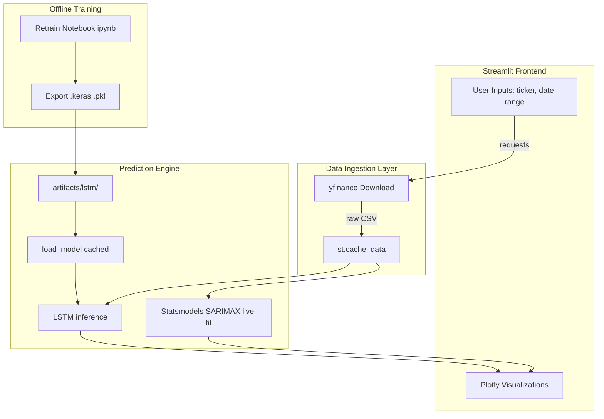

# 📈 Stock Market Price Prediction System
*An End-to-End Hybrid Forecasting Application (SARIMAX + LSTM)*


An end-to-end interactive web app that downloads live NSE stock data, visualises historical prices, extracts long-term trends, and forecasts future prices using two independent models — a classical statistical model (SARIMAX) and a pre-trained deep-learning LSTM neural network — all rendered as interactive Plotly charts on a single dark-themed dashboard.

---

## 🖥️ What the App Shows

| # | Section | What It Displays | Key Tech |
|:--|:---|:---|:---|
| 1 | **Historical Price Chart** | Open, Close, High, Low as 4 distinct coloured lines (amber/green/red/purple) | `go.Scatter` × 4, Plotly dark theme |
| 2 | **Long-Term Trend** | Underlying price direction stripped of weekly noise | `seasonal_decompose(additive, period=5)` |
| 3 | **SARIMAX Forecast** | Historical actual (green) + N-day forecast (yellow dotted) + 95% confidence band | `SARIMAX(1,1,2)(1,1,2,5)`, `get_forecast()` |
| 4 | **LSTM Forecast** | Full continuous timeline: training → validation → recent actual bridge → future forecast | Pre-trained Keras model, `artifacts/lstm/` |
| 5 | **Model Accuracy** | RMSE, MAE, R² on validation set | `metrics.pkl` artifact |

**All controls live in the sidebar:** stock picker, date range, column to forecast, SARIMAX days, LSTM days.

---

## 🌟 Core Features

- **Robust Data Ingestion & Caching:** Integrates `yfinance` to pull live data. `@st.cache_data` eliminates redundant API calls, dropping load times to milliseconds and preventing rate-limiting.
- **Dual-Model Mathematical Engine:** Combines the interpretable, live-fit forecasting of **SARIMAX** with the deep, non-linear pattern recognition of **LSTM** neural networks.
- **"Train Offline, Infer Online" Pipeline:** The LSTM is trained offline in a Jupyter Notebook. The Streamlit app loads the exported artifacts (3.5MB) into RAM exactly once using `@st.cache_resource`, keeping the UI blazingly fast.
- **Cloud-Optimized:** Uses `tensorflow-cpu` to keep the footprint under 500MB, ensuring stability on free-tier cloud deployments (Streamlit Community Cloud, Heroku).

---

## 🏗️ Technical Architecture



*The core architectural decision is decoupling the heavy LSTM training (Offline Notebook) from the real-time Streamlit application. The app simply consumes the cached `.keras` and `.pkl` artifacts.*

---

## ⚙️ Quick Start

```bash
# 1. Clone & enter
git clone <YOUR-REPO-URL>
cd <YOUR-REPO-DIRECTORY>

# 2. Virtual environment
python -m venv venv
venv\Scripts\activate        # Windows
# source venv/bin/activate   # Mac/Linux

# 3. Install
pip install -r requirements.txt

# 4. Run
streamlit run app.py
```

App opens at `http://localhost:8501`.

---

## 🔄 Retraining the LSTM

1. Open `STOCK MARKET PREDICITION PROJECT.ipynb` in Jupyter.
2. Change the `ticker` variable in the data loading function if needed.
3. Run all cells — new `.keras` and `.pkl` artifacts are auto-saved to `artifacts/lstm/`.
4. Restart the Streamlit app — the new model loads immediately.

---

## ☁️ Deploy to Streamlit Cloud

1. Push repo to GitHub *(ensure the `artifacts/` folder is included!)*
2. Go to [share.streamlit.io](https://share.streamlit.io) → **New App**
3. Select repo, branch `main`, main file `app.py`
4. Click **Deploy** — live in ~2 minutes

---

## 🧠 Key Engineering Decisions

| Decision | Why |
|:---|:---|
| **Train offline, infer online** | Training LSTM in a web server causes timeouts; artifacts decouple compute from serving. |
| `@st.cache_data` for yfinance | Prevents re-downloading on every UI interaction; avoids Yahoo Finance rate-limiting. |
| `@st.cache_resource` for Keras model | Loads the heavy Keras model exactly once per server lifecycle as a singleton. |
| `pd.bdate_range()` for forecast dates | Auto-excludes weekends from all forecast timelines. |
| `tensorflow-cpu` in requirements | Strips CUDA/cuDNN GPU libs; keeps deployment under 500 MB RAM (free-tier safe). |
| Keras compat shim `_load_model_compat`| Tries `keras` then `tensorflow.keras` — works regardless of environment setup. |
| `ffill().bfill()` + `extrapolate_trend` | Prevents `seasonal_decompose` crash on NaN gaps occasionally found in yfinance data. |

---

## ⚠️ Limitations

- LSTM predictions are based on the saved artifact set; predictions are directional, not exchange-grade.
- SARIMAX parameters are hardcoded (`p=1,d=1,q=2`); `auto_arima` would be more optimal.
- `yfinance` may be rate-limited under heavy usage; a dedicated data provider is recommended for production scale.
- **Not financial advice.** For educational and portfolio purposes only.

---

## 📁 Project Structure

```
├── app.py                              # Streamlit application
├── STOCK MARKET PREDICITION PROJECT.ipynb  # LSTM training notebook
├── artifacts/
│   └── lstm/
│       ├── lstm_model.keras            # Trained model weights
│       ├── scaler.pkl                  # MinMaxScaler fitted on training data
│       ├── features.pkl                # Feature list
│       ├── last_sequence.pkl           # Last 60-day window for inference
│       ├── metrics.pkl                 # RMSE, MAE, R² from validation
│       ├── history_payload.pkl         # Training + validation series for chart
│       └── future_payload.pkl          # Optional pre-computed future values
├── requirements.txt
└── README.md
```
